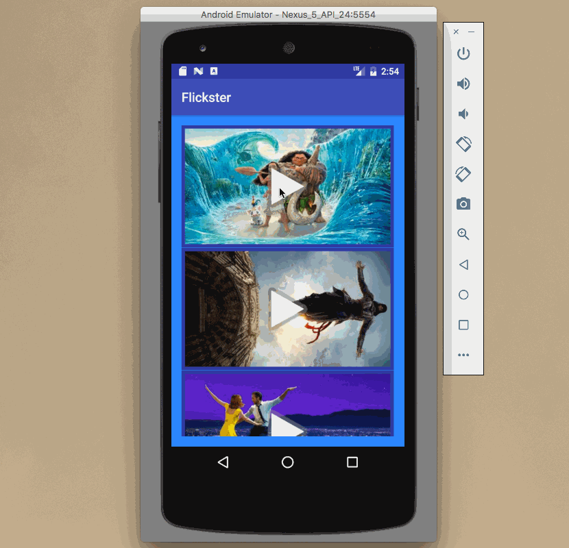

# Flixster Demo

This is an Android demo application for displaying the latest box office movies using the api given in the class.

Time spent: 6 hours spent in total

Completed user stories:

 * [x] Required: User can view a list of movies (title, poster image, and overview) currently playing in theaters from the Movie Database API.
 * [x] Required: Lists should be fully optimized for performance with the ViewHolder pattern.
 * [x] Optional: Use Styles and Themes to keep your layout files clean of view styles. (1 point)
 * [x] Optional: Improve the user interface through styling and coloring (1 to 5 points depending on the difficulty of UI improvements)
 * [x] Optional: For popular movies (i.e. a movie voted for more than 5 stars), the full backdrop image is displayed. Otherwise, a poster image, the movie title, and overview is listed. Use Heterogenous ListViews and use different ViewHolder layout files for popular movies and less popular ones. (2 points)
 * [x] Optional: Expose details of movie (ratings using RatingBar, popularity, and synopsis) in a separate activity. (3 points)
 * [x] Optional: Allow video posts to be played in full-screen using the YouTubePlayerView (2 points)
 * [x] Optional: Add a play icon overlay to popular movies to indicate that the movie can be played (1 point).
 
Notes:

Spent some time making the UI work across multiple phone resolutions by playing around with the RelativeLayout.

Walkthrough of all user stories:

GIF created with [LiceCap](http://www.cockos.com/licecap/).
